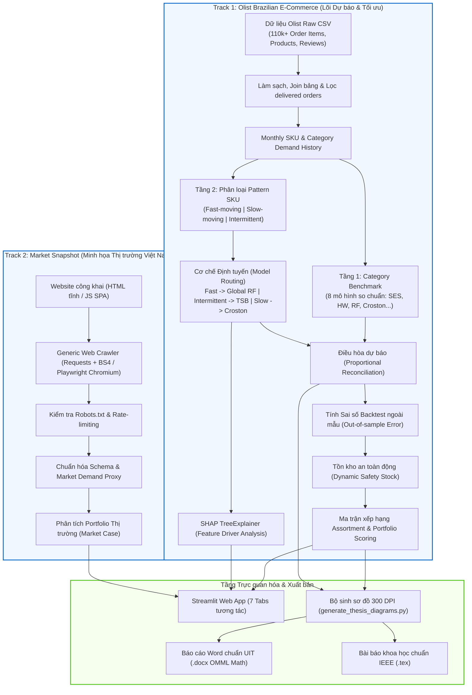

# 📦 Dual-Level Pattern-Routed Demand Forecasting & Risk-Aware Portfolio Optimization for E-Commerce

<div align="center">

[](https://www.python.org/)
[](https://streamlit.io/)
[](https://scikit-learn.org/)
[](https://playwright.dev/)
[-brightgreen?logo=pytest&logoColor=white)](tests/)
[](docs/)
[](LICENSE)

**HỆ THỐNG DỰ BÁO NHU CẦU ĐA CẤP ĐỊNH TUYẾN THEO DEMAND PATTERN VÀ TỐI ƯU HÓA DANH MỤC SẢN PHẨM PHÒNG NGỪA RỦI RO TRONG THƯƠNG MẠI ĐIỆN TỬ**

*Khóa luận / Chuyên đề Tốt nghiệp — Khoa Hệ thống Thông tin, Trường Đại học Công nghệ Thông tin, ĐHQG-HCM (UIT)*  
**Sinh viên thực hiện:** Nguyễn Văn Thịnh — **MSSV:** 25730149

</div>

---

## 📑 Mục lục

1. [Tổng quan dự án](#-tổng-quan-dự-án)
2. [Kiến trúc hệ thống & Luồng dữ liệu](#-kiến-trúc-hệ-thống--luồng-dữ-liệu)
3. [Tính năng cốt lõi](#-tính-năng-cốt-lõi)
4. [Phương pháp luận & Mô hình toán](#-phương-pháp-luận--mô-hình-toán)
   - [4.1. Phân loại Demand Pattern](#41-phân-loại-demand-pattern-syntetos-boylan)
   - [4.2. Bộ mô hình & Cơ chế Định tuyến (Routing)](#42-bộ-8-mô-hình--cơ-chế-định-tuyến-routing)
   - [4.3. Điều hòa dự báo đa cấp (Proportional Reconciliation)](#43-điều-hòa-dự-báo-đa-cấp-proportional-reconciliation)
   - [4.4. Tồn kho an toàn động từ Sai số Backtest](#44-tồn-kho-an-toàn-động-safety-stock-từ-sai-số-backtest)
   - [4.5. Xếp hạng danh mục đa mục tiêu (Portfolio Scoring)](#45-xếp-hạng-danh-mục-đa-mục-tiêu-portfolio-scoring)
   - [4.6. Giải thích mô hình bằng SHAP (Explainable AI)](#46-giải-thích-mô-hình-bằng-shap-explainable-ai)
5. [Kết quả thực nghiệm & Benchmark](#-kết-quả-thực-nghiệm--benchmark)
6. [Cấu trúc mã nguồn](#-cấu-trúc-mã-nguồn)
7. [Hướng dẫn cài đặt & Khởi chạy](#-hướng-dẫn-cài-đặt--khởi-chạy)
   - [7.1. Chuẩn bị môi trường](#71-chuẩn-bị-môi-trường)
   - [7.2. Tải dữ liệu Olist](#72-tải-dữ-liệu-olist)
   - [7.3. Thực thi Pipeline End-to-End](#73-thực-thi-pipeline-end-to-end)
   - [7.4. Khởi chạy Dashboard Streamlit](#74-khởi-chạy-dashboard-streamlit)
   - [7.5. Chạy bộ kiểm thử (Unit Tests)](#75-chạy-bộ-kiểm-thử-unit-tests)
8. [Bộ thu thập dữ liệu thị trường (Market Crawler)](#-bộ-thu-thập-dữ-liệu-thị-trường-market-crawler)
   - [8.1. Thu thập Web HTML tĩnh (Static Engine)](#81-thu-thập-web-html-tĩnh-static-engine)
   - [8.2. Thu thập Web JavaScript / SPA (Playwright Engine)](#82-thu-thập-web-javascript--spa-playwright-engine)
   - [8.3. Nguyên tắc an toàn & Tuân thủ Robots.txt](#83-nguyên-tắc-an-toàn--tuân-thủ-robotstxt)
9. [Xuất bản báo cáo & Công bố học thuật](#-xuất-bản-báo-cáo--công-bố-học-thuật)
10. [Hệ thống tài liệu dự án](#-hệ-thống-tài-liệu-dự-án)
11. [Tác giả & Bản quyền](#-tác-giả--bản-quyền)

---

## 🌟 Tổng quan dự án

Trong ngành bán lẻ trực tuyến (E-commerce), các quyết định về thu mua và quản trị danh mục sản phẩm đối mặt với hai rào cản lớn:
1. **Hiệu ứng đuôi dài (Long-Tail) và nhu cầu thưa thớt (Intermittent Demand):** Hơn 85% sản phẩm ở cấp SKU có chu kỳ mua ngắt quãng, chứa nhiều tháng không phát sinh đơn (zero-demand months), khiến các mô hình thống kê chuỗi thời gian cổ điển (ARIMA, Holt-Winters) bị thổi phồng dự báo hoặc sụp đổ sai số.
2. **Nguy cơ đứt gãy vốn do tồn kho:** Sai lệch dự báo trực tiếp dẫn tới chi phí lưu kho cao (overstocking) hoặc mất doanh thu do thiếu hàng (stockout). Hầu hết hệ thống hiện nay tách rời khâu dự báo với khâu tính toán tồn kho đệm (safety stock).

### Đột phá của giải pháp

Dự án này phát triển một hệ sinh thái hoàn chỉnh giải quyết triệt để các hạn chế trên:

- **Kiến trúc dự báo 2 tầng (Dual-Level Forecasting):**
  - **Tầng Category (Vĩ mô):** Benchmark 8 mô hình dự báo chuỗi thời gian trên 50 danh mục sản phẩm; mô hình Simple Exponential Smoothing (SES) đạt độ chính xác cao với WAPE chỉ **22.68%**.
  - **Tầng SKU (Vi mô):** Phân loại 800 SKU theo đặc tính nhu cầu (Syntetos-Boylan: *Fast-moving*, *Slow-moving*, *Intermittent*) và định tuyến thông minh sang thuật toán chuyên biệt (Global Random Forest, Croston, TSB). Cơ chế định tuyến giúp giảm WAPE từ **140.73%** (baseline đơn lẻ) xuống **118.78%** (giảm 21.95 điểm phần trăm).
- **Điều hòa dự báo phân cấp (Top-Down Proportional Reconciliation):** Khớp nối dự báo tổng thể cấp danh mục xuống từng SKU thành phần nhằm bảo toàn tính nhất quán ngân sách.
- **Tối ưu danh mục tích hợp Tồn kho an toàn (Risk-Aware Portfolio Optimization):** Tính toán trực tiếp tồn kho đệm (Safety Stock) từ sai số thực tế ngoài mẫu (Backtest Error $\sigma_e$) thay vì độ lệch chuẩn nhu cầu tĩnh, xây dựng ma trận ưu tiên đa mục tiêu kết hợp biên lợi nhuận, doanh thu và rủi ro.
- **Khả năng giải thích với SHAP TreeExplainer (XAI):** Minh bạch hóa các yếu tố tác động (lags, rolling momentum, zero-demand rate) ở cấp độ toàn cục và trên từng quyết định của từng SKU.
- **Bộ thu thập dữ liệu thị trường (Dual-Engine Web Scraper):** Thu thập dữ liệu đối sánh tại Việt Nam từ cả website HTML tĩnh và Single Page Application (SPA render qua JavaScript) với Playwright Chromium, hoàn toàn tự động kiểm tra `robots.txt`.
- **Giao diện tương tác Streamlit 7 Phân hệ & Hệ thống xuất báo cáo:** Hỗ trợ ra quyết định thời gian thực và tích hợp bộ công cụ tự động xuất Báo cáo tốt nghiệp Microsoft Word (.docx chuẩn OMML Math) và Bài báo nghiên cứu LaTeX (.tex chuẩn IEEE).

---

## 🏗 Kiến trúc hệ thống & Luồng dữ liệu

Kiến trúc hệ thống được thiết kế theo luồng xử lý kép (Dual-Track Data Flow), phân định rõ ràng giữa dữ liệu chuỗi thời gian lịch sử (Forecasting Core) và dữ liệu thị trường đối chuẩn (Market Proxy):



> [!NOTE]
> **Nguyên tắc phân định dữ liệu:** Dữ liệu Olist được dùng làm nguồn kiểm định dự báo chính nhờ có chuỗi thời gian đơn hàng thực tế kéo dài 2 năm. Snapshot thị trường (Tiki, Chợ Tốt, Books) đóng vai trò minh họa khả năng thích ứng danh mục trong bối cảnh thị trường thực tế tại Việt Nam, không dùng để backtest do thiếu chiều lịch sử.

---

## ⚡ Tính năng cốt lõi

| Phân hệ | Tính năng chi tiết | Ý nghĩa thực tiễn |
| :--- | :--- | :--- |
| **Ingestion & Data Pipeline** | Làm sạch 110,197 giao dịch Olist, liên kết 9 bảng dữ liệu, lọc đơn hàng thành công, nội suy lịch sử tháng. | Tạo lập cơ sở dữ liệu chuỗi thời gian sạch, triệt tiêu đơn hủy/trả hàng. |
| **Model Benchmarking** | So chuẩn 8 thuật toán dự báo tại cấp Category với horizon tùy biến (1–12 tháng). | Đánh giá khách quan mô hình tốt nhất cho tổng thể ngành hàng. |
| **Pattern-Based Routing** | Tự động phân loại 800 SKU theo ADI và CV², định tuyến đến Global Random Forest, TSB hoặc Croston. | Xử lý hiệu quả nhu cầu gián đoạn, ngăn ngừa hiện tượng dự báo âm hoặc sụt giảm đột ngột. |
| **Hierarchical Reconciliation** | Điều hòa tỷ lệ (Top-Down Proportional Reconciliation) từ dự báo danh mục xuống từng SKU. | Đảm bảo tổng SKU khớp chính xác 100% với dự báo ngân sách vĩ mô của danh mục. |
| **Dynamic Safety Stock** | Tích hợp sai số chuẩn $\sigma_e$ từ out-of-sample backtest để tính tồn kho an toàn ở 95% service level ($z = 1.65$). | Khắc phục điểm yếu của công thức safety stock truyền thống vốn giả định nhu cầu phân phối chuẩn. |
| **Portfolio Decision Engine** | Chấm điểm đa mục tiêu Top-N sản phẩm, phân tích ma trận ABC-XYZ, kiểm soát giới hạn đa dạng hóa danh mục (<40%/ngành). | Hỗ trợ nhà bán lẻ ra quyết định nhập hàng, loại bỏ SKU ứ đọng và tập trung vốn vào nhóm sinh lời cao. |
| **Explainable AI (SHAP)** | SHAP TreeExplainer trích xuất tầm quan trọng của đặc trưng theo nhóm và biểu đồ waterfall cho từng SKU. | Đem lại sự minh bạch cho mô hình Machine Learning, giúp nhà quản trị hiểu rõ lý do đằng sau số dự báo. |
| **Dual-Engine Web Scraper** | Hỗ trợ crawl bằng Requests + BeautifulSoup (web tĩnh) và Playwright Chromium (web JS/SPA), tuân thủ `robots.txt`. | Dễ dàng trích xuất thông tin giá, lượng bán, đánh giá từ mọi sàn thương mại điện tử công khai. |
| **Interactive Dashboard** | Giao diện Streamlit 7 phân hệ với bộ lọc động, biểu đồ Plotly tương tác và xuất file báo cáo. | Trực quan hóa toàn diện từ dữ liệu vĩ mô đến quyết định vi mô. |

---

## 📐 Phương pháp luận & Mô hình toán

### 4.1. Phân loại Demand Pattern (Syntetos-Boylan)

Dựa trên nghiên cứu kinh điển của Syntetos & Boylan (2005), hệ thống phân loại 800 SKU Olist dựa trên hai chỉ số:
- **Khoảng cách nhu cầu trung bình (ADI - Average Demand Interval):**
  $$ADI = \frac{N}{k}$$
  *(Trong đó $N$ là tổng số kỳ quan sát, $k$ là số kỳ có phát sinh nhu cầu).*
- **Bình phương hệ số biến thiên (CV² - Squared Coefficient of Variation):**
  $$CV^2 = \left( \frac{\sigma_z}{\mu_z} \right)^2$$
  *(Trong đó $\sigma_z$ và $\mu_z$ lần lượt là độ lệch chuẩn và trung bình của các kỳ nhu cầu dương).*

```text
       CV²
        ^
        |     Intermittent       |       Lumpy
   0.49 +------------------------+------------------------
        |      Smooth (Fast)     |     Erratic (Slow)
        +------------------------+------------------------> ADI
                                1.32
```

Hệ thống cụ thể hóa thành 3 trạng thái hoạt động:
1. **Fast-Moving ($ZeroMonthRate \le 0.35$ và $CV < 1.2$):** Nhu cầu diễn ra đều đặn, số kỳ zero-demand thấp (93 SKU).
2. **Intermittent ($ZeroMonthRate \ge 0.50$ hoặc $ADI \ge 1.4$):** Nhu cầu gián đoạn, thưa thớt, khoảng lặng giữa các đơn hàng lớn (277 SKU).
3. **Slow-Moving:** Nhu cầu chậm, tốc độ luân chuyển trung bình (430 SKU).

### 4.2. Bộ 8 mô hình & Cơ chế Định tuyến (Routing)

Hệ thống cài đặt và benchmark 8 mô hình dự báo chuỗi thời gian:
1. **Naïve:** $\hat{y}_{T+h|T} = y_T$ (Baseline điểm mốc gần nhất).
2. **Moving Average (SMA):** Trung bình trượt 6 tháng gần nhất.
3. **Seasonal Naïve:** $\hat{y}_{T+h|T} = y_{T+h-m}$ ($m = 12$ tháng).
4. **Simple Exponential Smoothing (SES):** Làm phẳng hàm mũ đơn với hệ số $\alpha \in (0, 1)$ tối ưu hóa.
5. **Holt-Winters Exponential Smoothing:** Làm phẳng hàm mũ bậc cao kết hợp xu thế (trend).
6. **Croston Method (1972):** Tách rời chuỗi nhu cầu thành kích thước đơn ($z_t$) và khoảng cách đơn ($p_t$):
   $$\hat{y}_t = \frac{z_t}{p_t}$$
7. **Teunter-Syntetos-Babai (TSB - 2011):** Cập nhật liên tục xác suất phát sinh nhu cầu ($d_t$) tại mọi kỳ, kể cả kỳ nhu cầu bằng 0, khắc phục hiện tượng trễ của Croston:
   $$\hat{y}_t = d_t \cdot z_t$$
8. **Global Panel Random Forest Regressor:** Mô hình học máy đa biến tổng hợp toàn bộ SKU trên không gian đặc trưng trượt:
   - Các biến trễ (Lags): $Lag_1, Lag_2, Lag_3, Lag_6, Lag_{12}$.
   - Thống kê trượt (Rolling moments): Rolling mean 3m/6m, Rolling std 3m/6m.
   - Đặc trưng gián đoạn: Zero-demand rate trong 6 tháng gần nhất.
   - Đặc trưng lịch & thời gian: Month, Quarter, Trend step.
   - Đặc trưng ngữ cảnh sản phẩm: Category encoding, Giá trung bình, Điểm đánh giá (Review score).

#### Ma trận định tuyến (Routing Logic)

```text
               [SKU Demand Pattern]
                         |
        +----------------+----------------+
        |                                 |
   [Fast-Moving]                  [Slow / Intermittent]
        |                                 |
        v                                 v
(Global Random Forest)            [Kiểm tra Zero-Rate]
(122 SKUs)                                |
                           +--------------+--------------+
                           |                             |
                      Zero-Rate < 0.50             Zero-Rate >= 0.50
                           |                             |
                           v                             v
                       (Croston)                       (TSB)
                      (401 SKUs)                    (277 SKUs)
```

### 4.3. Điều hòa dự báo đa cấp (Proportional Reconciliation)

Để bảo đảm tính nhất quán tài chính giữa kế hoạch ngân sách cấp Danh mục (Top-level) và số lượng tồn kho từng SKU (Bottom-level), hệ thống áp dụng kỹ thuật điều hòa tỷ lệ Top-Down:

$$\hat{y}_{i, t}^{\text{reconciled}} = \text{round} \left( \hat{Y}_{c, t} \times \frac{\hat{y}_{i, t}^{\text{raw}}}{\sum_{j \in c} \hat{y}_{j, t}^{\text{raw}}} \right)$$

*Trong đó $\hat{Y}_{c, t}$ là dự báo độc lập cấp danh mục $c$ (từ mô hình SES tối ưu), $\hat{y}_{i, t}^{\text{raw}}$ là dự báo độc lập từ mô hình định tuyến của SKU $i$.*

### 4.4. Tồn kho an toàn động (Safety Stock) từ Sai số Backtest

Khác biệt với các công thức truyền thống tính safety stock từ độ biến động nhu cầu lịch sử $\sigma_d$ (dẫn tới ước lượng sai khi nhu cầu có xu hướng hoặc mùa vụ), hệ thống trích xuất độ lệch chuẩn sai số dự báo thực nghiệm ngoài mẫu ($\sigma_{e, i}$) từ quá trình backtest:

$$SS_i = \left\lceil z \cdot \sigma_{e, i} \cdot \sqrt{H} \right\rceil$$

- $z = 1.65$: Hệ số dịch vụ tương ứng Cycle Service Level **95%**.
- $\sigma_{e, i}$: Độ lệch chuẩn sai số backtest ngoài mẫu của SKU $i$ ($\sqrt{\frac{1}{K}\sum (y_{i,t} - \hat{y}_{i,t})^2}$).
- $H$: Horizon dự báo (mặc định $H = 6$ tháng).

**Điểm đặt hàng lại (Reorder Point - ROP):**
$$ROP_i = \hat{y}_{i, \text{lead\_time}} + SS_i$$

### 4.5. Xếp hạng danh mục đa mục tiêu (Portfolio Scoring)

Điểm số ưu tiên của từng SKU được tổng hợp từ 5 chiều chỉ số chuẩn hóa theo phân vị (Percentile Ranking):

$$\text{PortfolioScore}_i = 0.30 \cdot \text{Rank}(\text{Profit}_i) + 0.25 \cdot \text{Rank}(Q_i + SS_i) + 0.20 \cdot \text{Rank}(\text{Rev}_i) + 0.15 \cdot \text{PatternScore}_i + 0.10 \cdot (1 - \text{Rank}(UR_i))$$

- **Profit:** Lợi nhuận gộp kỳ vọng = Doanh thu dự báo $\times$ Tỷ suất lợi nhuận biên danh mục.
- **Risk-adjusted Volume ($Q_i + SS_i$):** Khối lượng nhu cầu dự báo cộng tồn kho an toàn đệm.
- **Pattern Score:** Điểm tin cậy theo phân loại vận tốc bán hàng ($Fast = 1.0, Slow = 0.6, Intermittent = 0.3$).
- **Uncertainty Ratio ($UR_i$):** Tỷ lệ bất định $= \sigma_{e, i} / (\hat{y}_i + 1)$.
- **Ràng buộc đa dạng hóa danh mục:** Không một danh mục đơn lẻ nào được phép chiếm quá **40%** tổng quy mô danh mục Top-N đề xuất.

### 4.6. Giải thích mô hình bằng SHAP (Explainable AI)

Hệ thống tích hợp thuật toán **SHAP TreeExplainer** trên mô hình Global Random Forest để phân rã giá trị dự báo $f(x)$ thành tổng đóng góp cộng tính của từng đặc trưng:

$$f(x) = \phi_0 + \sum_{j=1}^{M} \phi_j(x)$$

- **Fast-moving:** Đóng góp chủ đạo thuộc về $Lag_1$ và $RollingMean_{3m}$, phản ánh quán tính tiêu thụ ngắn hạn là tín hiệu dự báo mạnh nhất.
- **Intermittent:** Đóng góp lớn nhất thuộc về $ZeroDemandRate$ và $RollingStd$, chứng minh rằng tần suất xuất hiện giao dịch quyết định sản lượng lớn hơn nhiều so với giá trị đơn hàng tức thời.

---

## 📊 Kết quả thực nghiệm & Benchmark

### 1. Benchmark 8 mô hình tại cấp Danh mục (Category-Level)

Backtest trên tập holdout 3 tháng trên toàn bộ 50 danh mục sản phẩm Olist:

| Hạng | Mô hình | MAE | RMSE | WAPE (%) | Bias | Nhận định học thuật |
| :---: | :--- | :---: | :---: | :---: | :---: | :--- |
| 🥇 | **Simple Exp Smoothing (SES)** | **21.87** | **41.09** | **22.68%** | **+11.14** | **Tốt nhất:** Thích ứng nhanh với thay đổi mức nền mà không bị quá khớp (overfitting). |
| 🥈 | Naïve Baseline | 21.92 | 41.44 | 22.74% | +10.67 | Bám sát giá trị tháng liền trước rất hiệu quả trên chuỗi tổng gộp. |
| 🥉 | Global Random Forest | 23.45 | 44.30 | 24.33% | +9.69 | Khai thác tốt đặc trưng phi tuyến và tương tác giữa các danh mục. |
| 4 | Simple Moving Average (6m) | 29.19 | 55.98 | 30.29% | +7.30 | Độ trễ pha cao khi có đột biến xu thế. |
| 5 | Holt-Winters Exponential Smoothing | 29.19 | 55.98 | 30.29% | +7.30 | Dễ bị nhiễu do ước lượng xu thế trên chuỗi ngắn (24 tháng). |
| 6 | Teunter-Syntetos-Babai (TSB) | 32.91 | 75.70 | 34.14% | -25.84 | Không phù hợp cho chuỗi dày (aggregate category) vì giảm giá trị dự báo. |
| 7 | Croston Method | 33.10 | 76.07 | 34.34% | -26.08 | Đánh giá thấp nhu cầu liên tục do giả định chuỗi thưa. |
| 8 | Seasonal Naïve (12m) | 47.07 | 99.36 | 48.83% | -38.03 | Kém nhất do lịch sử Olist 2 năm chưa đủ 2 chu kỳ mùa hoàn chỉnh. |

### 2. Hiệu quả cải tiến tại cấp SKU (Pattern-Routed Gains)

Đánh giá trên 800 SKU Olist đại diện cho toàn bộ các phân khúc nhu cầu:

```text
+------------------------------------+-----------+-----------+--------------+
| Cấu hình mô hình                   |    MAE    |   RMSE    |   WAPE (%)   |
+------------------------------------+-----------+-----------+--------------+
| Baseline đơn lẻ (Holt-Winters)     |   2.65    |   5.82    |   140.73%    |
| Kiến trúc Định tuyến Pattern-Routed|   2.24    |   5.04    |   118.78%    |
+------------------------------------+-----------+-----------+--------------+
| Mức độ cải thiện thực nghiệm       | -15.47%   | -13.40%   | -21.95 pts   |
+------------------------------------+-----------+-----------+--------------+
```

> [!IMPORTANT]
> **Giải thích về chỉ số WAPE ở cấp SKU:** Trong E-commerce, WAPE cấp SKU thường cao hơn cấp danh mục vì nhu cầu SKU riêng lẻ chứa tới 60–80% số 0 (hiện tượng thưa thớt). Giá trị WAPE 118.78% phản ánh đúng bản chất đuôi dài; dự báo SKU không dùng để cam kết số lượng tuyệt đối mà được tích hợp cùng phân vị rủi ro và Safety Stock để phục vụ **ra quyết định nhập hàng**.

### 3. Phân bổ danh mục Top-30 & Buffer Sizing

- **Tổng số SKU đưa vào dự báo:** 800 SKU (50 danh mục).
- **Phân bổ Pattern:** 93 Fast-moving, 430 Slow-moving, 277 Intermittent.
- **Phân bổ tuyến mô hình:** 122 Global Random Forest, 401 Croston, 277 TSB.
- **Dự báo tổng sản lượng (6 tháng):** 42,304 đơn vị sản phẩm (~6.72 triệu R$ doanh thu).
- **Danh mục ưu tiên Top-30:**
  - Sản lượng dự báo cơ sở (Point Forecast): **9,791 units**.
  - Tồn kho an toàn đệm (Dynamic Safety Stock): **520 units**.
  - Tổng số lượng đề xuất có phòng ngừa rủi ro (Risk-adjusted Quantity): **10,311 units**.
  - Tỷ lệ giới hạn danh mục được kích hoạt: Giữ cho tỷ trọng các nhóm ngành máy tính, đồ chơi, gia dụng, làm đẹp cân bằng và không bị chi phối bởi một nhóm hàng duy nhất.

---

## 📁 Cấu trúc mã nguồn

```text
demand_forecasting/
├── app.py                             # Ứng dụng Streamlit Dashboard đa phân hệ (7 Tabs)
├── pyproject.toml                     # Cấu hình đóng gói Python Package chuẩn PEP 517/621
├── requirements.txt                   # Danh mục thư viện phụ thuộc (pinned versions)
├── README.md                          # Tài liệu hướng dẫn kỹ thuật chính
│
├── configs/                           # File cấu hình JSON thu thập dữ liệu
│   └── books_to_scrape.json           # Template mẫu CSS selector cho website công khai
│
├── data/                              # Lưu trữ dữ liệu hệ thống (Data Lake)
│   ├── raw/                           # Dữ liệu thô (Olist CSV, Market snapshots)
│   ├── processed/                     # Dữ liệu sạch, bảng enriched, chuỗi thời gian tháng
│   └── outputs/                       # Kết quả forecast, backtest metrics, portfolio recommendations
│       └── charts/                    # 20 biểu đồ học thuật xuất bản chất lượng cao (300 DPI)
│
├── docs/                              # Toàn bộ tài liệu kỹ thuật & học thuật
│   ├── system_design.md               # Thiết kế kiến trúc chi tiết, pipeline flow & I/O schema
│   ├── model_evaluation.md            # Phương pháp luận benchmark, công thức toán & chỉ số lỗi
│   ├── data_strategy.md               # Chiến lược dữ liệu & cơ sở lựa chọn Olist vs. Market Proxy
│   ├── dashboard_data_dictionary.md   # Từ điển dữ liệu toàn bộ các cột trong hệ thống
│   ├── paper_demand_forecasting.md    # Bản thảo bài báo khoa học tiếng Anh
│   └── paper_demand_forecasting.tex   # Bài báo khoa học định dạng LaTeX chuẩn IEEE
│
├── scripts/                           # Tập lệnh tự động hóa vận hành pipeline
│   ├── download_olist.py              # Tự động tải / cấu trúc dữ liệu Olist raw
│   ├── run_pipeline.py                # Chạy pipeline dự báo & tối ưu hóa end-to-end
│   ├── crawl_public_site.py           # CLI thu thập website công khai (Static BS4 / Playwright JS)
│   ├── crawl_tiki_snapshot.py         # Crawler tương thích ngược snapshot Tiki
│   ├── build_tiki_case_from_csv.py    # Xây dựng market case từ file CSV thị trường
│   ├── export_report_word.py          # Xuất báo cáo tốt nghiệp Word (.docx) chuẩn OMML Math
│   ├── export_paper_latex.py          # Xuất bản thảo bài báo khoa học LaTeX (.tex)
│   └── generate_thesis_diagrams.py    # Sinh hệ thống sơ đồ kiến trúc & luồng xử lý 300 DPI
│
├── src/ecom_forecasting/              # Module mã nguồn cốt lõi (Core Python Package)
│   ├── __init__.py                    # Khai báo package ecom_forecasting
│   ├── config.py                      # Định nghĩa đường dẫn, hằng số và tham số hệ thống
│   ├── crawlers/                      # Phân hệ thu thập & chuẩn hóa dữ liệu web
│   │   ├── __init__.py
│   │   ├── public_site.py             # Bộ crawler đa năng (Static BS4 & Playwright Headless)
│   │   ├── scraping.py                # Tiện ích bóc tách text, chuẩn hóa số liệu & giá
│   │   └── tiki_case.py               # Xử lý adapter dữ liệu thị trường Tiki
│   ├── data/                          # Phân hệ xử lý dữ liệu (ETL & Time Series)
│   │   ├── __init__.py
│   │   ├── olist.py                   # Ingestion, join bảng, lọc trạng thái, enrich giao dịch
│   │   ├── time_series.py             # Lưới chuỗi thời gian, tổng hợp theo tháng cho Category & SKU
│   │   ├── preprocessing.py           # Làm sạch dữ liệu, xử lý missing & outliner
│   │   └── eda.py                     # Trích xuất phân tích khám phá dữ liệu & tương quan
│   ├── models/                        # Phân hệ Mô hình hóa Dự báo & XAI
│   │   ├── __init__.py
│   │   ├── forecasting.py             # Cài đặt 8 mô hình dự báo, routing, top-down reconciliation
│   │   ├── evaluation.py              # Đánh giá chỉ số: MAE, RMSE, WAPE, Bias, Error Std
│   │   └── explainability.py          # XAI: SHAP TreeExplainer, grouped feature drivers
│   ├── optimization/                  # Phân hệ Tối ưu hóa Chuỗi cung ứng
│   │   ├── __init__.py
│   │   └── portfolio.py               # Safety stock out-of-sample, ROP, ABC-XYZ, Portfolio score
│   └── services/                      # Phân hệ Điều phối Dịch vụ (Orchestration Layer)
│       ├── __init__.py
│       ├── pipeline.py                # Điều phối luồng chạy end-to-end từ raw data đến kết quả
│       └── dashboard_data.py          # Đóng gói và trích xuất chỉ số phục vụ Dashboard Streamlit
│
└── tests/                             # Bộ kiểm thử tự động hóa (Automated Test Suite)
    ├── test_package_structure.py      # Kiểm thử kiến trúc gói & tương thích import
    ├── test_forecasting.py            # Kiểm thử toán học 8 mô hình & thuật toán reconciliation
    ├── test_optimization.py           # Kiểm thử tính toán safety stock, điểm portfolio & cap
    └── test_public_site.py            # Kiểm thử parser selector, robots.txt & schema crawler
```

---

## 🚀 Hướng dẫn cài đặt & Khởi chạy

### 7.1. Chuẩn bị môi trường

Dự án yêu cầu **Python 3.10 trở lên** (khuyến nghị **Python 3.12**).

#### Trên Windows (PowerShell):
```powershell
# 1. Khởi tạo môi trường ảo
py -3.12 -m venv .venv

# 2. Kích hoạt môi trường ảo
.\.venv\Scripts\Activate.ps1

# 3. Cài đặt toàn bộ dependencies
pip install --upgrade pip
pip install -r requirements.txt
pip install -e .
```

#### Trên Linux / macOS (Bash):
```bash
# 1. Khởi tạo môi trường ảo
python3 -m venv .venv

# 2. Kích hoạt môi trường ảo
source .venv/bin/activate

# 3. Cài đặt toàn bộ dependencies
pip install --upgrade pip
pip install -r requirements.txt
pip install -e .
```

*(Tùy chọn)* Nếu muốn sử dụng tính năng crawl web Single Page Application (SPA render qua JavaScript như Shopee, Chợ Tốt...), cài đặt trình duyệt Chromium cho Playwright:
```bash
playwright install chromium
```

---

### 7.2. Tải dữ liệu Olist

Hệ thống cung cấp script tự động tải dữ liệu gốc từ bộ dataset chuẩn Brazilian E-Commerce:

```powershell
python scripts\download_olist.py
```
> File dữ liệu sẽ được lưu trữ tự động tại thư mục `data/raw/olist/`.

---

### 7.3. Thực thi Pipeline End-to-End

Chạy toàn bộ pipeline xử lý dữ liệu, benchmark mô hình, định tuyến SKU, điều hòa tỷ lệ và chấm điểm danh mục:

```powershell
python scripts\run_pipeline.py --horizon 6 --top-n 30 --max-products 800 --min-months 4
```

**Các tham số tùy chỉnh:**
- `--horizon`: Số tháng dự báo trong tương lai (mặc định: `6`).
- `--top-n`: Số lượng SKU tối ưu trong danh mục ưu tiên đề xuất (mặc định: `30`).
- `--max-products`: Số lượng SKU hàng đầu được lọc đưa vào dự báo (mặc định: `800`).
- `--min-months`: Số tháng tối thiểu phát sinh đơn để SKU được coi là hợp lệ (mặc định: `4`).

---

### 7.4. Khởi chạy Dashboard Streamlit

Sau khi chạy xong pipeline, khởi động web dashboard để trực quan hóa kết quả:

```powershell
streamlit run app.py --server.port 8501
```

Mở trình duyệt tại địa chỉ: `http://localhost:8501`

**Giao diện bao gồm 7 Phân hệ nghiệp vụ chuyên sâu:**
1. **Olist Overview:** Doanh thu, lợi nhuận gộp theo tháng, tỷ trọng danh mục và phân bổ Demand Pattern.
2. **Forecast:** So sánh chuỗi lịch sử và dự báo tương lai ở cả hai cấp độ: Category và từng SKU cụ thể.
3. **Model Evaluation:** Bảng xếp hạng 8 mô hình dự báo với biểu đồ so chuẩn trực quan (MAE, RMSE, WAPE, Bias).
4. **Portfolio:** Ma trận phân loại ABC-XYZ, đề xuất số lượng nhập hàng đã cộng Safety Stock đệm.
5. **Model Explainability:** SHAP Waterfall biểu diễn lực đẩy/kéo của từng đặc trưng lên quyết định dự báo của SKU.
6. **Market Case:** Giao diện trực quan để người dùng nhập URL hoặc file JSON, thực hiện crawl dữ liệu thị trường đối sánh và cập nhật ngay vào bảng xếp hạng.
7. **Data:** Bộ trình diễn và tải xuống toàn bộ dữ liệu bảng sạch và kết quả xuất ra.

---

### 7.5. Chạy bộ kiểm thử (Unit Tests)

Dự án tích hợp bộ kiểm thử tự động toàn diện kiểm tra tính toán toán học, tính hợp lệ của schema và cấu trúc package:

```powershell
pytest -v
```

Kết quả kiểm thử đạt **12/12 test case Passed (100%)**:
- `tests/test_package_structure.py`: Kiểm thử cấu trúc mô-đun và import.
- `tests/test_forecasting.py`: Kiểm thử 8 mô hình thống kê, ML và thuật toán điều hòa tỷ lệ.
- `tests/test_optimization.py`: Kiểm thử công thức Safety Stock, giới hạn đa dạng hóa danh mục.
- `tests/test_public_site.py`: Kiểm thử parser trích xuất CSS selector, xử lý giá tiền tệ và tuân thủ `robots.txt`.

---

## 🌐 Bộ thu thập dữ liệu thị trường (Market Crawler)

Hệ thống tích hợp module crawler độc lập, có thể thu thập thông tin sản phẩm (tên, giá, đánh giá, lượt bán, thương hiệu) từ bất kỳ website công khai nào.

### 8.1. Thu thập Web HTML tĩnh (Static Engine)

Sử dụng thư viện `requests` kết hợp `BeautifulSoup4` cho các trang web hiển thị nội dung trực tiếp qua HTML tĩnh:

**Cách 1: Sử dụng file cấu hình JSON mẫu (Khuyến nghị)**
```powershell
python scripts\crawl_public_site.py configs\books_to_scrape.json --top-n 50
```

**Cách 2: Chạy trực tiếp qua tham số dòng lệnh CLI**
```powershell
python scripts\crawl_public_site.py `
  --url "https://books.toscrape.com/catalogue/page-{page}.html" `
  --site-name "Books to Scrape" `
  --product-selector "article.product_pod" `
  --field "title=h3 a" `
  --attribute "title=title" `
  --field "price=.price_color" `
  --field "rating=p.star-rating" `
  --attribute "rating=class" `
  --field "product_url=h3 a" `
  --attribute "product_url=href" `
  --constant "category=Books" `
  --pages 2 `
  --top-n 30
```

---

### 8.2. Thu thập Web JavaScript / SPA (Playwright Engine)

Đối với các website render danh sách sản phẩm bằng JavaScript phía client (React/Vue/Angular), hệ thống hỗ trợ engine Playwright điều khiển trình duyệt Chromium chạy ngầm (Headless):

```powershell
python scripts\crawl_public_site.py `
  --engine playwright `
  --url "https://www.chotot.com/do-dien-tu" `
  --site-name "Chợ Tốt" `
  --product-selector "div[class*='AdItem']" `
  --wait-selector "div[class*='AdItem']" `
  --scroll-count 5 `
  --scroll-delay-ms 1000 `
  --field "title=[class*='adTitle']" `
  --field "price=[class*='price']" `
  --field "product_url=a[href*='.htm']" `
  --attribute "product_url=href" `
  --constant "category=Đồ điện tử" `
  --top-n 50
```

---

### 8.3. Nguyên tắc an toàn & Tuân thủ Robots.txt

Module crawler được thiết kế dựa trên tiêu chuẩn đạo đức thu thập dữ liệu (Ethical Web Scraping):
- **Tự động kiểm tra `robots.txt`:** Kiểm tra URL trước khi gửi request; tự động từ chối nếu bị cấm bởi `Disallow`.
- **Cơ chế tôn trọng `crawl-delay`:** Duy trì độ trễ giữa các request (mặc định 1.0 giây).
- **Nhận diện User-Agent minh bạch:** Khai báo User-Agent định danh phục vụ học thuật.
- **Dừng an toàn:** Tự động ngắt khi gặp mã trạng thái HTTP `401`, `403` hoặc `429`.
- **Cam kết:** Không bao giờ bypass captcha, đăng nhập hay vượt rào kiểm soát truy cập cá nhân.

---

## 📄 Xuất bản báo cáo & Công bố học thuật

Dự án cung cấp bộ công cụ tự động biên dịch toàn bộ dữ liệu, mô hình toán và kết quả thực nghiệm ra các định dạng chuẩn học thuật:

### 1. Xuất Báo cáo Chuyên đề tốt nghiệp Microsoft Word (.docx)
Script tích hợp bộ chuyển đổi công thức toán LaTeX sang **native Microsoft Office OMML (Office Math Markup Language)**, triệt tiêu hoàn toàn lỗi vỡ font ký hiệu toán học trong Word:

```powershell
python scripts\export_report_word.py
```
> File Word hoàn chỉnh được xuất tại: `docs/Bao_Cao_Chuyen_De_Tot_Nghiep_NguyenVanThinh_25730149.docx`.

### 2. Xuất Bài báo nghiên cứu khoa học LaTeX (.tex)
Tạo tệp mã nguồn bài báo theo định dạng chuẩn hai cột của **IEEE Conference Template**:

```powershell
python scripts\export_paper_latex.py
```
> File LaTeX được xuất tại: `docs/paper_demand_forecasting.tex` (sẵn sàng biên dịch trên Overleaf, MiKTeX hoặc TeX Live).

### 3. Sinh hệ thống sơ đồ học thuật 300 DPI
Tự động vẽ và xuất 20 sơ đồ kiến trúc, luồng phân phối đuôi dài, cơ chế Croston, sliding window và ma trận danh mục phục vụ in ấn ấn phẩm:

```powershell
python scripts\generate_thesis_diagrams.py
```
> Toàn bộ hình ảnh chất lượng cao được lưu tại: `data/outputs/charts/`.

---

## 📚 Hệ thống tài liệu dự án

Để tìm hiểu sâu hơn về từng khía cạnh kỹ thuật của hệ thống, vui lòng tham khảo các tài liệu chuyên đề chi tiết trong thư mục [`docs/`](docs/):

- 📘 [**Thiết kế kiến trúc hệ thống (`docs/system_design.md`)**](docs/system_design.md): Sơ đồ chi tiết các module, giao thức I/O, ràng buộc kỹ thuật và luồng dữ liệu.
- 📐 [**Phương pháp đánh giá mô hình (`docs/model_evaluation.md`)**](docs/model_evaluation.md): Định nghĩa toán học của 8 mô hình dự báo, công thức tính toán chỉ số lỗi và phân tích chi tiết.
- 🎯 [**Chiến lược dữ liệu (`docs/data_strategy.md`)**](docs/data_strategy.md): Cơ sở lựa chọn dataset Olist làm nền tảng và vị trí của market snapshot trong bài toán thực tế.
- 📖 [**Từ điển dữ liệu Dashboard (`docs/dashboard_data_dictionary.md`)**](docs/dashboard_data_dictionary.md): Bảng tra cứu ý nghĩa, định dạng và nguồn gốc của tất cả các trường dữ liệu.
- 📑 [**Bản thảo bài báo nghiên cứu Markdown (`docs/paper_demand_forecasting.md`)**](docs/paper_demand_forecasting.md): Toàn văn bài báo khoa học tiếng Anh gồm 5 phần chuẩn cấu trúc IMRAD.

---

## 👨‍💻 Tác giả & Bản quyền

- **Tác giả:** Nguyễn Văn Thịnh
- **Mã số sinh viên:** 25730149
- **Ngành học:** Công nghệ Thông tin
- **Khóa luận:** Chuyên đề Tốt nghiệp — Hệ Thống Dự Báo Nhu Cầu & Tối Ưu Hóa Danh Mục Sản Phẩm Thương Mại Điện Tử
- **Đơn vị công tác:** Khoa Hệ thống Thông tin, Trường Đại học Công nghệ Thông tin, Đại học Quốc gia TP. Hồ Chí Minh (UIT)
- **Email học thuật:** `25730149@uit.edu.vn`
- **GitHub Repository:** [ThinhNguyenV/demand-forecasting-system-product-portfolio-optimization-ecommerce](https://github.com/ThinhNguyenV/demand-forecasting-system-product-portfolio-optimization-ecommerce)

---

<div align="center">

Dự án được phân phối dưới giấy phép **MIT License**. Mọi quyền được bảo lưu © 2026 Nguyễn Văn Thịnh.

*Developed with passion for Data Science & E-Commerce Operations at University of Information Technology (VNU-HCM).*

</div>